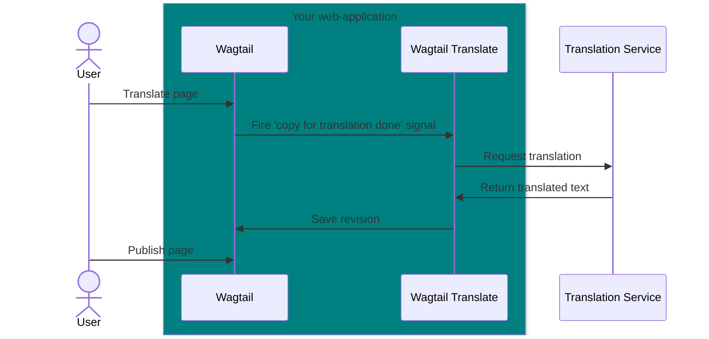

# Explanation

This document details the concepts underlying Wagtail Translate and explains the reasoning behind its design choices. It aims to enhance and expand your understanding of Wagtail Translation.

## Idea and positioning

[Wagtail Localize](https://wagtail-localize.org/) and [Wagtail Simple Translation](https://docs.wagtail.org/en/stable/reference/contrib/simple_translation.html) are the go-to solutions for multilingual Wagtail projects.
Wagtail Localize offers advanced features that may be excessive for many projects, while Wagtail Simple Translation only copies pages to new locales, requiring manual translation.

**Wagtail Translate** adds machine translations to Wagtail. It works with Simple Translation, providing an ideal solution for projects seeking a straightforward interface with robust translation support.

Your content editors will appreciate the simplicity of Wagtail Translate. 🥳

## Features

- Automatic translation
- Integration with DeepL
- Highly customizable

## Architecture

Wagtail Translate operates at the model level and does not include a user interface. While using Wagtail Translate in combination with Wagtail Simple Translation is the obvious choice, it is not a strict requirement.

Wagtail Translate listens for Wagtail's `copy_for_translation_done` signal to initiate the machine translation.
Wagtail Translate is indifferent on who sends the signal. This could be Simple Translation, other products, or custom code.

The default behavior:


## Customizing default behaviors

Wagtail Translate is designed to be flexible, allowing you to tailor its behavior to your needs.

- Provide your own translation service
- Define your own signal handler
- Customize the translation process

## Background workers

Wagtail Translate uses external services like DeepL to provide translations. These services can take time, fail to respond, or be offline.

By default, Wagtail Translate handles translations synchronously, meaning they block the current thread, and the user must wait for all translations to complete. This can negatively impact performance and user experience.

Django's [background workers](https://www.djangoproject.com/weblog/2024/may/29/django-enhancement-proposal-14-background-workers/) are an accepted proposal and are in development. Once available, they will offer a unified way to offload tasks. Wagtail Translate is expected to support them. For now, if you need translations offloaded to a background task, you can customize the default behaviors and implement this yourself.

## Fields to translate

Wagtail Translate introspects the model definition to identify the fields that need translation. You can control which fields are translated by implementing a `get_translatable_fields` method on your model.

## HTML

Wagtail has rich text and raw fields, which may contain HTML. Translating HTML is challenging because the structure (tags and attributes) must remain unchanged, while the text between tags should be translated.

Wagtail Translate deconstructs HTML and translates the text parts one by one, then reconstructs the HTML with the translated text. However, this process can lead to a lack of context for the translation service. For example:

```html
<p>The <em>black</em> cat</p>
```
Translating word-for-word into French yields:
```html
<p>Le <em>noir</em> chat</p>
```
But it should be translated as:
```html
<p>Le chat <em>noir</em></p>
```

Word order can vary across languages, and words may have different meanings depending on the context. For instance, the word "bow" can refer to a weapon for shooting arrows or a gesture of respect. In French, these are translated as "arc" and "révérence," respectively. If translation service has too little context, there is a risk of incorrect translation.

Wagtail Translate preserves the HTML structure to prevent broken HTML, as translating tags and attributes could lead to invalid markup.

In practice, most HTML translates well, but if you encounter odd translations, this may be the cause. A workaround might be removing the styling from the text before translation and re-apply the styling after.

You can alter the HTML translation behavior by providing a custom translation class and overriding the `BaseTranslator.translate_html` method.

## Translation of related objects

For related objects (foreign keys) Wagtail Translate checks if the object is translatable, and if the translations exist. If the translation exists, it is used; otherwise, the original object is used.

This approach prevents deep traversal as related objects can have related objects of their own. It also accommodates intentional cross-language references. For example, a multilingual site might have blogs exclusively in English, requiring links to the English posts regardless of the referencing page's locale.

Since Wagtail Translate can't forsee the intended behaviour, it uses the simplest approach: use if the translation exists, otherwise use the original object. This  means that sometimes the content editor needs to step in and translate the related object, and select that related object.

To adjust this behaviour, override `BaseTranslator.translate_related_object`.
